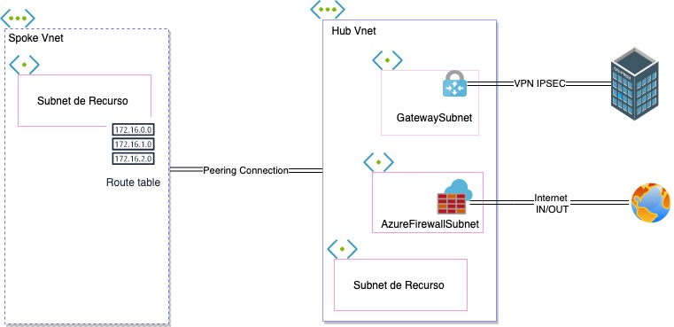

# Terraform-Azure-Topo-HubSpoke
Topologia usada neste exemplo. 

### Ref:
- [Topologia de rede hub-spoke no Azure
](https://docs.microsoft.com/pt-br/azure/architecture/reference-architectures/hybrid-networking/hub-spoke?tabs=cli)

## Requirements

| Name | Version |
|------|---------|
|  [azurerm](#requirement\_azurerm) | >=2.60.0 |

## Providers

No providers.

## Modules

| Name | Source | Version |
|------|--------|---------|
|  [rg\_vnet\_hub\_br](#module\_rg\_vnet\_hub\_br) | ./resources-groups |  |
|  [rg\_vnet\_hub\_us](#module\_rg\_vnet\_hub\_us) | ./resources-groups |  |
|  [rg\_vnet\_spoke](#module\_rg\_vnet\_spoke) | ./resources-groups |  |

## Resources

No resources.

## Inputs

No inputs.

## Outputs

No outputs.
